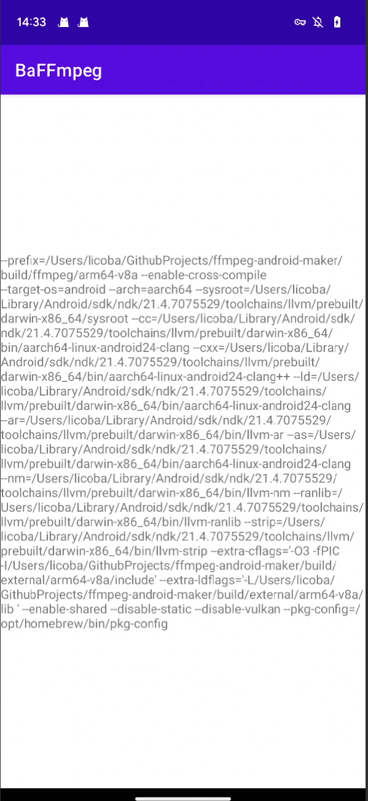

# Android-FFmpeg

> Android的FFmpeg学习项目
-----

## 编译so库
#### macOS平台编译so库
##### [https://juejin.cn/post/6942493653944238088](https://juejin.cn/post/6942493653944238088)
编译一次so库大概需要十几分钟
NDK版本选择21的`ndk.dir=/Users/licoba/Library/Android/sdk/ndk/21.4.7075529 `
出现的警告都可以忽略
编译出来的so库如果带有版本号，就手动修改
得到的文件在根目录下的`android`文件夹里


也可以用第三方的 
[https://github.com/Javernaut/ffmpeg-android-maker/wiki/Available-script-arguments#ffmpeg-source-code-origin](https://github.com/Javernaut/ffmpeg-android-maker/wiki/Available-script-arguments#ffmpeg-source-code-origin)
用这个脚本就可以构建了
```
./ffmpeg-android-maker.sh -abis=arm64 --android-api-level=30 --source-tar=6.0
```

## 集成so库
[https://blog.csdn.net/jun5753/article/details/126819292](https://blog.csdn.net/jun5753/article/details/126819292)

## 运行结果
